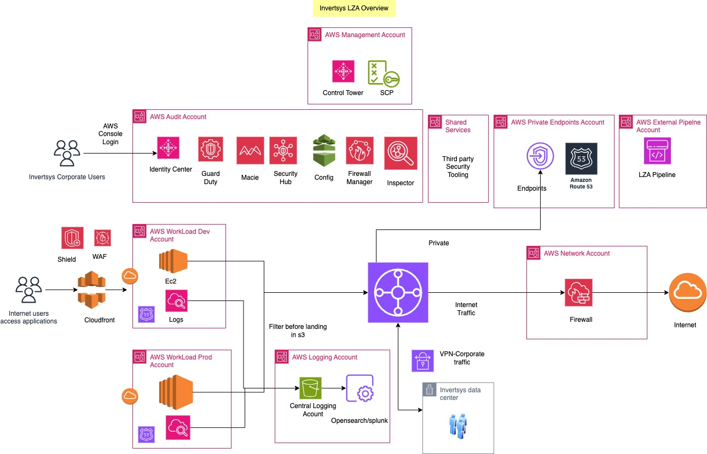

# aws-landing-zone-accel
Invertsys prescriptive aws platform design and deployment configuration files repository

# Invertsys Platform Architecture diagram

# Problem Statement

Federal and commercial customers want to develop applications on AWS, but they lack the ability to create AWS accounts and apply network and security foundations to those accounts in accordance with AWS Well-Architected best practices. Invertsys will help deploy the AWS platform using AWS's open-source offering, AWS Landing Zone Accelerator (LZA), within three months, following AWS best practices. We can then migrate an application into the LZA and hand it over to the customer operations team

# AWS LZA Benefits
Automation: AWS LZA automates the deployment of foundational resources like accounts, Vpc’s, ensuring consistency and compliance across AWS regions

Network: By deploying VPCs and network configurations across accounts, centralize management of network traffic, internet connectivity, and user access. This setup supports compliance with TIC 3.0 for federal custoemrs, enhancing the security and efficiency of network operations.

Security and Compliance: AWS LZA centralizes the management of AWS security services, making it easier to enforce policies and track compliance. Enabled CISA/NIST compliance requirements, providing centralized visibility and reporting on security findings.

Deployment: AWS LZA follows DevOps practices, allowing platform administrators to use Infrastructure as Code to deploy foundational components such as account creation, networking, and security using code pipeline. This approach effectively transforms your platform team into a DevSecOps team.  

# Invertsys Platform Architecture diagram

# Repository Information 
This repository contains the following configuration files as per the architecture diagram.

1. network-config.yaml - IPAM, Gateway load balancers with Palo Alto, Route53 resolver with CISA forwarders, Endpoint, VPC, Shared Service VPC,VPNs, Network Inspection, VPC Templates, VPC Flow logs
2. accounts-config.yaml - Foundational accounts, Network, External Pipeline, and Sandbox
3. customizations-config.yaml - Firewalls, WAF
4. iam-config.yaml - Identity center configuration with permission sets, roles, groups, users
5. security-config.yaml - Security, GuardDuty, EBSKMS key, config, and S3 block
6. organization-config.yaml - Create organizations, tagging
7. global-config.yaml - SNS, logging with filters, billing notifications, global tags

# Deployment

1. Install AWS Landing Zone Accelerator
   [AWS LZA Deployment] (https://aws.amazon.com/solutions/implementations/landing-zone-accelerator-on-aws/)

2. Design the AWS Platform: Below are the tasks you need to make decisions on:

    * AWS Organizational Units
    * AWS Identity and Access Management using Identity Center and integration with an external IDP like Okta
    * AWS Transit Gateway and AWS routing
    * Palo Alto Firewalls for internet and internal connectivity
    * VPN Design to Corprate Datanceter
    * AWS WAF for user access to applications
    * Centralized logging to an S3 bucket in the Logging account
    * AWS preventive and detective controls using AWS security services
    * AWS encryption and protecting S3 buckets
    * Billing notifications

3. Implement the above design: There are configuration files under aws-landing-zone-accel that will help you deploy the solution. 
   
# Contact Information:

If you need help deploying the solution, we have a team of AWS professionals who can design your AWS platform, deploy it, and educate your team. We have successfully deployed solutions for several customers. Please reach out to us directly at accelerators@inversys.com.

### Happy Coding ###
